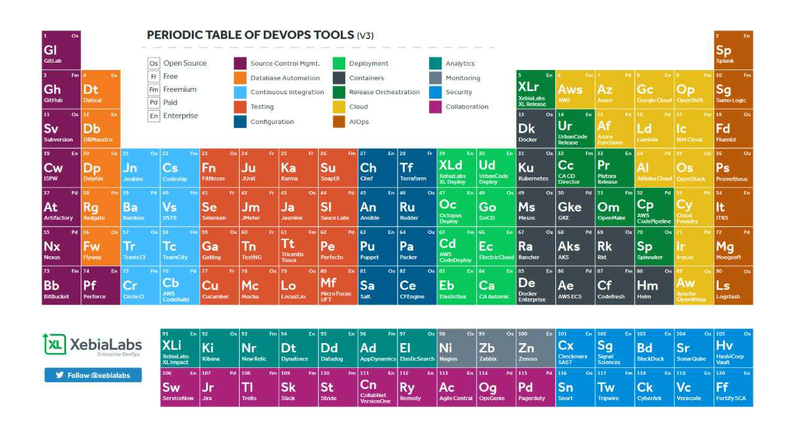

# Xamarin_Periodic_Table
Xamarin periodic table repo, this periodic table will include most of the Xamarin components present in the Xamarin Universe

## Vision
What we are trying to achieve is something like this image, but with contents exclusively related to Xamarin.
 

 
Once the list is finalized we will convert it to an image, and that would be showcased in the [Xamarin Universe](https://github.com/xamarinuniverse/XamarinUniversalLibrary), website. 

## Contributing
If you have any other component in mind which we should add or consider, please clone the repo, add the changes and make a pull request to the [dev](https://github.com/dev-aritra/Xamarin_Periodic_Table/tree/dev) branch. We will review and proceed accordingly.

## The RAW List
This the raw list which we have curated till now, feel free to add a subpoint or a section all together.

### 1. Languages:
  - C#
  - F#
  - XAML
  - AXML
  - XML
  - CSS
	
### 2. IDEs:
  - VS
  - VSM
	
### 3. Supported Platforms:
  - Android
  - iOS
  - UWP
  - GTK#
  - MacOS
  - Tiezen
	
### 4. DevOps:
  - VS App center
  - Azure DevOps
	
### 5. Live Reload:
  - LiveXAML
  - XAMLator
  - Gorilla
  - Live Reload
	
### 6. Other Extensions:
  - TBD
	
### 7. Build tools:
  - MSBuild
	
### 8. Development approach:
  - Xamarin Forms
  - Xamarin Native
  - Xamarin Native Forms

### 9. Code Sharing Strategies:
  - .NET Standard
  - Shared project
  - .Net Standard + Shared (Mixed)
	
### 10. UI Development tools:
  - Zeplyn
  - Inc to code
	
### 11. Ready to use UI components:
  - Syncfusion
  - Telerik
  - Infragistics
  - Grial
	
### 12. Charts:
  - MicroCharts
  - OxyPlot
	
### 13. MVVM Frameworks:
  - Prism
  - MvvmCross
  - MVVMLight
  - FreshMVVM
  - ReactiveUI
  - Caliburn.Micro
	
### 14. Profiling/ Inspection tools:
  - Xamarin profiler
  - Xamarin Inspector
  - UI Sleuth
	
### 15. Databases:
  - SQLite
  - Realm
  - Azure Storage
  - Akavache
	
### 16. Popular Architechtures:
  - MVVM
  - MVP
  - MVC
	
### 17. Game Engines/ AR:
  - CocosSharp
  - UrhoSharp
  - MonoGame
	
### 18. Official Learning platforms:
  - MS Learn (Xamarin University)
  - The Xamarin Show
  - Xamarin Microsoft docs
	
### 19. Newsletter/ Feeds
  - Weekly Xamarin
  - Planet Xamarin

### 20. Graphics Engines
  - SkiaSharp
  
### 21. Podcasts
  - Xamarin Podcast
  - Gone mobile
  - Merge Conflict

### 22. Runtime engines:
  - Mono.Android
  - Mono.Touch
  
### 23. Developer conference
  - Xamarin Evolve
  - Monkeyconf
  
### 24. Special mentions
  - Xamarin Universe
  
### 25. Others:	
- Xamarin Essential
- mFractor
- Creating Mobile Apps with Xamarin.Forms charles petzolds
	

	
	

	
	
	
	
